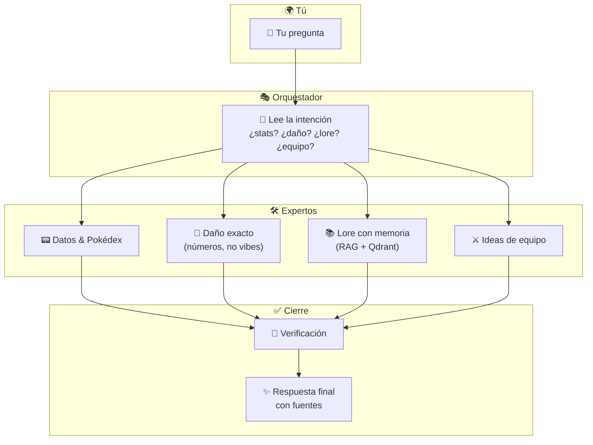

# 🔮⚡ Pokédex Arcana

> Tu asistente Pokémon con **cerebro de varios expertos**: datos de combate, números de daño que cuadran, lore con contexto y tips de equipo — todo en una interfaz que se siente como una Pokédex de verdad.

---

## 👋 ¿Qué es esto?

**Pokédex Arcana** es un proyecto para preguntar cosas difíciles sobre Pokémon y recibir respuestas **útiles y rastreables**: no solo “texto bonito”, sino respuestas apoyadas en **fuentes**, **stats reales** y, cuando toca, **matemática de daño** (la misma lógica del juego, sin adivinar).

Piénsalo como un **Profesor Pokémon** que por detrás reúne a un equipo de especialistas, los coordina y te devuelve una sola respuesta clara.

---

## ✨ ¿Qué se hizo? · ¿Cómo? · ¿Por qué?

| | |
|---:|---|
| **Qué** | Pasamos de una web Next antigua a un **front nuevo** (TanStack + Vite) con estilo Pokédex, arreglamos el **chat** para que hable bien con el backend, mejoramos **Pokédex**, **equipo**, **comparar stats** con gráfica, y pulimos detalles de UX (cartas, scroll largo, filtros de generación). |
| **Cómo** | El **backend** sigue siendo el mismo cerebro (FastAPI + agentes). El **front** ahora llama a la API con la misma “receta” que el servidor espera (por ejemplo el campo `query` en el chat y **CORS** para el puerto de Vite). Donde faltaban pantallas, las **conectamos** a endpoints que ya existían (`/compare`, `/teams/build`, detalle de Pokémon…). |
| **Por qué** | Queríamos una demo **bonita, rápida y honesta**: que se vea *bacana* 🎨, que no falle por un puerto mal puesto, y que el usuario entienda **de dónde sale** cada respuesta (stats, daño, lore, etc.). |

---

## 🧭 Cómo “piensa” el orquestador (versión sencilla)

No hace falta ser dev para entenderlo: **tú escribes** → un **director de orquesta** lee la pregunta → **manda a los especialistas correctos** → al final **un redactor** te lo cuenta todo en un solo mensaje, con citas cuando aplica.



> **Dato curioso:** el cálculo de daño va por una **fórmula fija** en código — así los números no “alucinan”. El lore competitivo puede apoyarse en **búsqueda vectorial** cuando la base está cargada en Qdrant.

---

## 🖥️ Qué verás en la app

| Ruta | Qué hace | Vibra |
|:---:|:---|:---|
| **Chat** 💬 | Preguntas libres con streaming (ves la respuesta ir formándose). | Charlando con el Profesor |
| **Pokédex** 🔍 | Explorar, filtrar por tipo y generación, abrir ficha con **stats**. | Hoja de la dex |
| **Equipo** ⚔️ | Borrador de equipo alrededor de un Pokémon ancla + debilidades. | Sala de entrenamiento |
| **Comparar** 📊 | Hasta 4 huecos **+** → abres mini-Pokédex, eliges mons → tabla + radar de stats. | Laboratorio |

**Puerto típico:** API en `http://127.0.0.1:18001` · Front en lo que diga Vite (ej. `http://localhost:8080`).  
Variable clave del front: `VITE_API_URL` en `apps/pokedex-arcana-frontend/.env`.

---

## 🚀 Arranque rápido (TL;DR)

```bash
uv sync
docker compose up -d          # Qdrant, Langfuse, etc. (opcional según lo que uses)
cp .env.example .env          # rellena GROQ_API_KEY, GEMINI_API_KEY…
```

**Terminal A — API**

```bash
cd apps/api
uv run uvicorn api.main:app --reload --host 127.0.0.1 --port 18001
```

**Terminal B — Front**

```powershell
cd apps/pokedex-arcana-frontend
Copy-Item .env.example .env -ErrorAction SilentlyContinue   # PowerShell
npm install
npm run dev
```

Abre la URL de Vite y prueba algo épico, por ejemplo:

> *If a Bold Abomasnow uses Blizzard against a Jigglypuff with 0 SpD EVs, how much damage does it do?*

Más detalle operativo: [`DEPLOYMENT.md`](./DEPLOYMENT.md) · Hoja de ruta: [`ROADMAP.md`](./ROADMAP.md).

---

## 🧱 Stack (sin marear)

| Capa | Tecnología |
|:---|:---|
| Front | React 19, TanStack Start/Router, Vite 7, Tailwind |
| API | Python, FastAPI |
| Agentes | LangGraph + orquestador propio |
| LLMs | Groq (Llama 3.x) · embeddings Gemini (u Ollama) |
| Datos | DuckDB / PokéAPI · Qdrant para RAG |

---

## 🧪 Probar que todo respira

```bash
uv run pytest -q
cd apps/pokedex-arcana-frontend && npm run build
```

---

## 📬 Autor & contacto

Hecho con cariño por **Jorge Andrés Martínez Santos** — si te gustó el proyecto, conectemos:

- 💼 [**LinkedIn**](https://www.linkedin.com/in/jorge-andres-martinez-santos-a59b45387/)
- 📸 [**Instagram @jorge_martinez_87**](https://www.instagram.com/jorge_martinez_87/)

> *“Hay que atraparlos ya…”* 🎵 — pero primero hay que entenderlos.

---

## 📎 Extras útiles

- Prompts y convenciones del front: [`apps/pokedex-arcana-frontend/CURSOR_PROMPT.md`](./apps/pokedex-arcana-frontend/CURSOR_PROMPT.md)
- Queries de demo: [`DEMO_QUERIES.md`](./DEMO_QUERIES.md) *(si existe en tu rama)*
